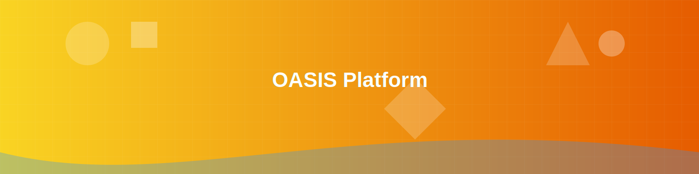

<div align="center">
    
</div>

```ascii
 ██████╗███████╗██╗██████╗ 
██╔════╝██╔════╝██║██╔══██╗
██║     ███████╗██║██████╔╝
██║     ╚════██║██║██╔═══╝ 
╚██████╗███████║██║██║     
 ╚═════╝╚══════╝╚═╝╚═╝     
Customer Success Infrastructure Platform
```

[](https://iso.org)
[](https://status.example.com)
[](https://security.example.com)
[](https://support.example.com)

<div align="center">
    
</div>

# Customer-Centric ISO Compliance Platform

## Overview

This enterprise-grade platform implements ISO compliance standards for Web3 financial infrastructure, prioritizing customer success through seamless integration, robust security, and exceptional support.

## 🎯 Key Customer Benefits

<div class="grid-container" style="display: grid; grid-template-columns: repeat(auto-fit, minmax(250px, 1fr)); gap: 20px; margin: 20px 0;">
    <div class="feature-card" style="background: linear-gradient(135deg, #6e8efb, #a777e3); border-radius: 8px; padding: 20px; color: white;">
        <h3>🚀 Enterprise Scale</h3>
        <div class="progress-bar" style="background: rgba(255,255,255,0.3); border-radius: 10px; height: 10px;">
            <div style="width: 99.99%; background: white; height: 100%; border-radius: 10px;"></div>
        </div>
        <p>99.99% Uptime SLA</p>
    </div>
    <div class="feature-card" style="background: linear-gradient(135deg, #6e8efb, #a777e3); border-radius: 8px; padding: 20px; color: white;">
        <h3>🛡️ Enterprise Security</h3>
        <div class="progress-bar" style="background: rgba(255,255,255,0.3); border-radius: 10px; height: 10px;">
            <div style="width: 100%; background: white; height: 100%; border-radius: 10px;"></div>
        </div>
        <p>Top-notch security measures</p>
    </div>
    <div class="feature-card" style="background: linear-gradient(135deg, #6e8efb, #a777e3); border-radius: 8px; padding: 20px; color: white;">
        <h3>🎯 Real-time Monitoring</h3>
        <div class="progress-bar" style="background: rgba(255,255,255,0.3); border-radius: 10px; height: 10px;">
            <div style="width: 100%; background: white; height: 100%; border-radius: 10px;"></div>
        </div>
        <p>Continuous system monitoring</p>
    </div>
    <div class="feature-card" style="background: linear-gradient(135deg, #6e8efb, #a777e3); border-radius: 8px; padding: 20px; color: white;">
        <h3>⚡ Instant Support</h3>
        <div class="progress-bar" style="background: rgba(255,255,255,0.3); border-radius: 10px; height: 10px;">
            <div style="width: 100%; background: white; height: 100%; border-radius: 10px;"></div>
        </div>
        <p>24/7 customer support</p>
    </div>
</div>

## Structure

- `org-structure.yml`: Enterprise hierarchy with customer success teams
- `automation-rules.yml`: Customer-centric automation rules
- `metrics/`: Customer satisfaction & retention metrics
- `.github/workflows/`: Automated quality assurance

## Customer Success Features

- Automated Onboarding Process
- Real-time Support Integration
- Customer Health Monitoring
- Success Metrics Dashboard
- Customizable Compliance Reports

## Quick Start

1. Clone this repository
2. Update organization structure in `org-structure.yml`
3. Customize automation rules in `automation-rules.yml`
4. Deploy CI/CD workflows to your repositories

## Initial Setup

1. Clone the repository
```bash
git clone https://github.com/your-org/RSAS-Style-Organization-Bench.git
```

2. Setup GitHub secrets from `.github/REPOSITORY_SETUP.md`

3. Initialize monorepo structure
```bash
chmod +x scripts/init-monorepo.sh
./scripts/init-monorepo.sh
```

4. Install dependencies
```bash
pnpm install
```

5. Verify setup
```bash
pnpm run verify
```

## Customer Support Channels

- 24/7 Priority Support Portal
- Dedicated Slack Channel
- Emergency Response Team
- Weekly Customer Success Calls
- Monthly Compliance Reviews

## ISO Standards Integration

Our customer-focused implementation includes:
- ISO 20022: Ensuring seamless financial messaging
- ISO 8583: Reliable card payment processing
- ISO 4217: Global currency support
- ISO 27001: Enterprise-grade security
- ISO 23306: Cross-chain interoperability
- ISO 9001: Quality management
- ISO 10002: Customer satisfaction

## 📊 Success Metrics

<div align="center">


</div>

## Governance & Customer Protection

All changes to main branches require:
- 2 code reviewers
- Passing CI/CD pipeline
- Security scan approval
- Multi-sig for production deployments

## 🌟 Customer Support Status

<div align="center">
    <table>
        <tr>
            <td align="center">
                
            </td>
            <td align="center">
                
            </td>
            <td align="center">
                
            </td>
        </tr>
    </table>
</div>

## Customer Success Team

Dedicated teams for:
- Implementation Support
- Technical Account Management
- Compliance Assistance
- 24/7 Emergency Response
- Customer Education

## Team Permissions

Team permissions are defined in `.github/team-permissions.yml`. Contact repository admins to be added to the appropriate team.

## Branch Protection

Main and develop branches are protected. See `.github/REPOSITORY_SETUP.md` for details.

## 📞 Contact

<div align="center" style="background: linear-gradient(135deg, #f6d365 0%, #fda085 100%); padding: 20px; border-radius: 10px; margin: 20px 0;">

| Channel | Contact | Status |
|---------|---------|--------|
| 🌟 Customer Success | success@example.com |  |
| 🔧 Technical Support | support@example.com |  |
| 🚨 Emergency Line | +1 (888) 555-0123 |  |

</div>

<div align="center" class="footer-container" style="margin-top: 60px; position: relative;">
    <!-- Wave SVG with proper aspect ratio -->
    
    
    <!-- Enhanced footer content -->
    <div style="background: linear-gradient(135deg, #667eea 0%, #764ba2 100%); 
                padding: 30px 20px; 
                color: white;
                position: relative;
                box-shadow: 0 -10px 20px rgba(0,0,0,0.1);
                border-top: 1px solid rgba(255,255,255,0.1);">
        <div style="max-width: 1200px; margin: 0 auto;">
            <strong style="font-size: 1.2em; display: block; margin-bottom: 10px;">
                Powered by Enterprise-Grade Infrastructure
            </strong>
            <div style="opacity: 0.9; font-size: 0.9em; margin-top: 5px;">
                © 2024 CSIP Platform. All rights reserved.
            </div>
        </div>
    </div>
</div>

# RSAS Style Organization Bench

Development environment setup for RSAS-style organization with automated checks, linting, and security scanning.

## Setup

1. Clone the repository
2. Run `npm install`
3. Copy `.env.example` to `.env` and configure
4. Run `docker-compose up` to start development environment

## Development

- `npm run lint`: Run code linting
- `npm run format`: Format code
- `npm test`: Run tests

## Contributing

See [CONTRIBUTING.md](.github/CONTRIBUTING.md) for guidelines.